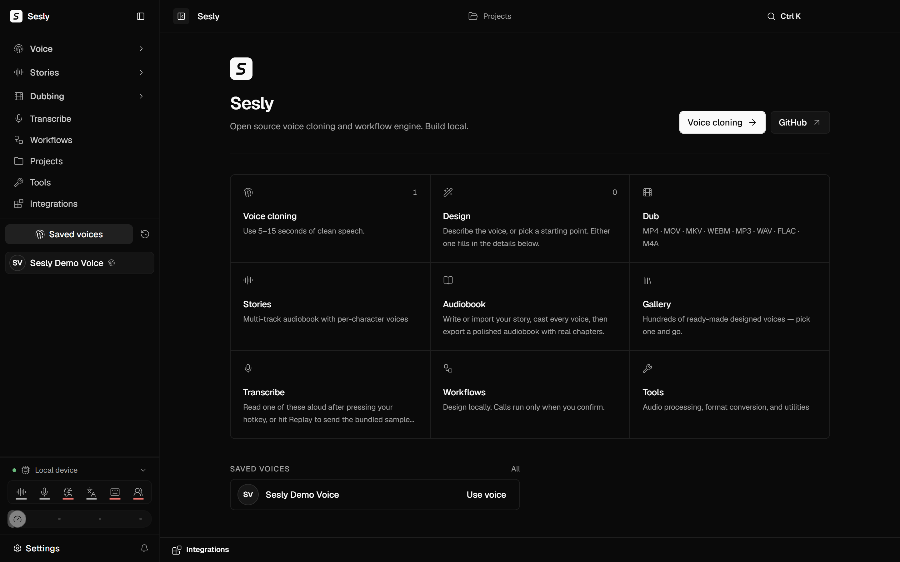
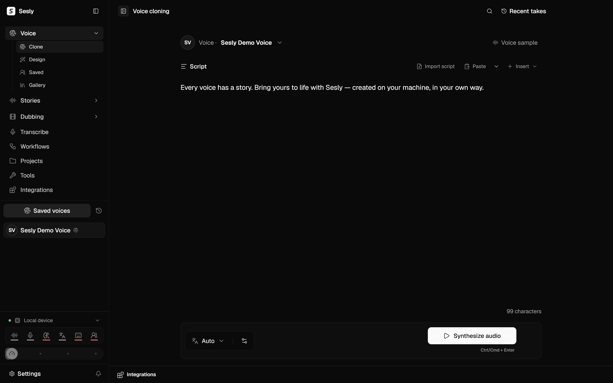
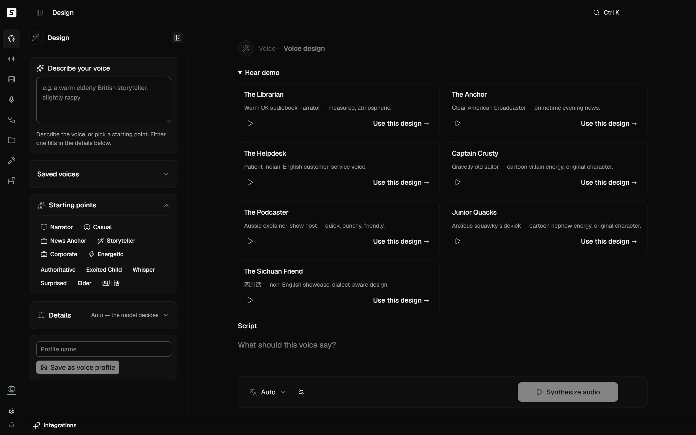
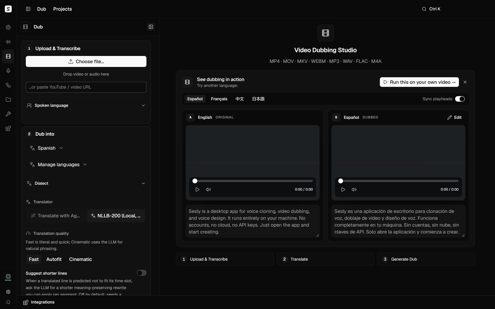
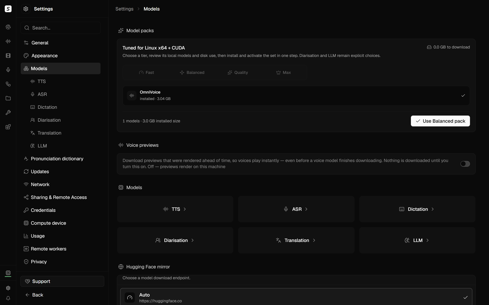
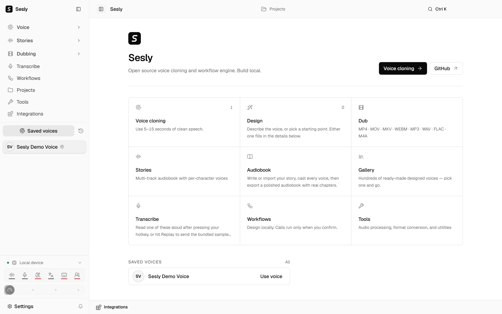
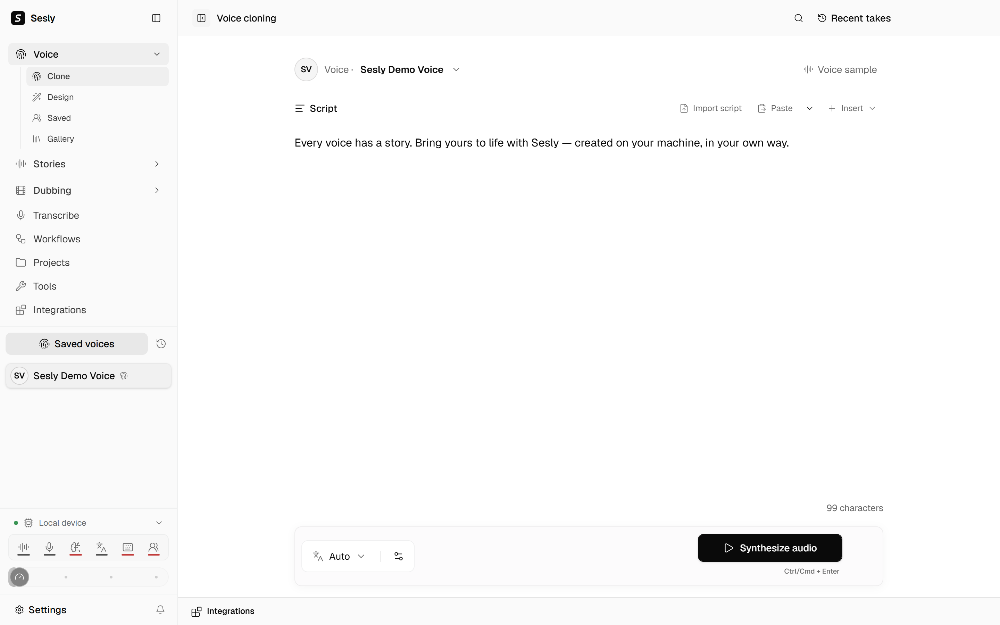

<div align="center">
  
  <h1>Sesly</h1>
  <p><strong>Open-source, fully-local voice studio — clone voices, design new ones, dub video, narrate audiobooks, and dictate, all on your own machine.</strong></p>
  <p>
    <a href="https://github.com/salihavcioglu/sesly/releases/latest">Download</a> ·
    <a href="#quick-start">Quick start</a> ·
    <a href="docs/STRUCTURE.md">Docs</a>
  </p>
  <p>
    <a href="https://github.com/salihavcioglu/sesly/actions/workflows/ci.yml"></a>
    <a href="https://github.com/salihavcioglu/sesly/releases/latest"></a>
    <a href="LICENSE"></a>
    
  </p>
</div>



Runs entirely on your machine — CUDA, ROCm, Apple MPS, or CPU, auto-detected.
No account, no required cloud calls, no API keys to get started. Swap in
whichever TTS/ASR engine fits your hardware and license needs (see
[Engines](#engines) below).

## Table of contents

- [Features](#features)
- [Screenshots](#screenshots)
- [Engines](#engines)
- [Requirements](#requirements)
- [Install](#install)
- [Quick start](#quick-start)
- [API](#api)
- [MCP](#mcp)
- [Configuration](#configuration)
- [Security](#security)
- [Privacy](#privacy)
- [Project structure](#project-structure)
- [Development & tests](#development--tests)
- [Roadmap](#roadmap)
- [Contributing](#contributing)
- [License](#license)

## Features

**Clone**
- Zero-shot voice cloning from 5–15 seconds of clean reference audio (up to 75 s accepted; how much of a longer clip is actually used depends on the engine — see [reference clip length](docs/engines/README.md#reference-clip-length)).
- 600+ languages with the default engine; per-engine language support varies (see [Engines](#engines)).
- Saved voice profiles, takes history, and a shareable voice gallery.

**Design**
- Build a voice from a text description or a taxonomy of gender / age / accent / pitch / style sliders — no reference audio required.
- Seven ready-made demo personas (narrator, news anchor, cartoon villain, and more) to start from or remix.

**Dub**
- Upload a file or paste a YouTube/video URL → transcribe → translate → re-voice → export, with per-speaker casting, dialect selection, and timing controls.
- Multi-track subtitles, glossary-aware translation, and incremental re-dub of just the segments you change.

**Long-form / Audiobooks**
- Script → plan → render into a chaptered, loudness-normalized audiobook with per-character casting and cover art.

**Dictation & Transcription**
- System-wide floating dictation widget with native text insertion.
- File and batch transcription (646 languages via the default ASR path), speaker diarization, and a pronunciation dictionary.

**Integrations**
- **OpenAI-compatible API** — point existing OpenAI TTS client code at Sesly's local `/v1` endpoints (see [API](#api)).
- **MCP server** — mounted on the running backend at `/mcp`, so agents (Claude Code, Cursor, Codex, …) can generate speech, clone voices, and transcribe audio directly (see [MCP](#mcp)).
- **Remote GPU workers** — keep the app and your projects local, and hand individual render jobs to another machine's GPU when you have one ([docs/remote-workers.md](docs/remote-workers.md)). A full [remote backend](docs/remote-gpu.md) mode is also available if you'd rather run the whole app on a GPU box.
- **Telephony & workflows** — Twilio/Plivo/Telnyx call handling and a local workflow canvas for chaining actions without a cloud automation account.

## Screenshots

| Voice cloning | Voice design |
|---|---|
|  |  |

| Video dubbing | Settings — models |
|---|---|
|  |  |

| Light mode — home | Light mode — voice cloning |
|---|---|
|  |  |

## Engines

Sesly ships with one default engine per job and lets you install others.
**Model weights carry their own license, separate from Sesly's own AGPL-3.0
code** — review the LICENSE column below (and each engine's guide) before any
commercial use.

> **The default TTS engine's weights (OmniVoice) are CC-BY-NC — non-commercial
> use only.** Sesly's own code (including the vendored `omnivoice/` runtime) is
> Apache-2.0, but the bundled model weights are not licensed for commercial
> use. If you need a commercially-usable stack out of the box, pick an
> Apache-2.0-weighted engine below (CosyVoice 3, MOSS-TTS-Nano, MOSS-TTS-v1.5,
> dots.tts, or Confucius4-TTS) or bring your own license-cleared weights.

| Engine | Job | License | Notes |
|---|---|---|---|
| OmniVoice (k2-fsa/OmniVoice) — **default** | TTS, cloning | Apache-2.0 code · **CC-BY-NC weights** | 600+ languages, zero-shot cloning; bundled, no extra install |
| CosyVoice 3 | TTS, cloning | Apache-2.0 | 9 languages, zero-shot, instruct-controllable |
| MOSS-TTS-Nano | TTS | Apache-2.0 | 20 languages, CPU-realtime, 48 kHz |
| MOSS-TTS-v1.5 | TTS, cloning | Apache-2.0 | 8B, 31 languages, zero-shot clone |
| dots.tts | TTS, cloning | Apache-2.0 | 2B, 24 languages, zero-shot clone, 48 kHz |
| Confucius4-TTS | TTS, cloning | Apache-2.0 | LLM-based, 14 languages, cross-lingual zero-shot clone |
| GPT-SoVITS | TTS, cloning | MIT | 5 languages, zero-shot/few-shot, external server |
| PocketTTS (Kyutai) | TTS, cloning | MIT code · CC-BY-4.0 weights | 6 languages, CPU-only, in-app license acceptance gate |
| Supertonic-3 | TTS | OpenRAIL-M | 31 languages, CPU ONNX, 7 preset voices, in-app license acceptance gate |
| IndexTTS 2.5 | TTS, cloning | Custom (bilibili Model Use License) | Multilingual, emotion-controlled cloning; commercial use has a usage-threshold clause — [review before use](docs/engines/indextts.md#license) |
| audio.cpp (Breeze-TTS-2) | TTS, cloning | Research/non-commercial | See [docs/engines/audio-cpp.md](docs/engines/audio-cpp.md) before enabling |
| KittenTTS | TTS | See upstream | English, 8 preset voices, CPU-realtime |
| VoxCPM2 | TTS, cloning + design | See upstream | 30 languages, studio 48 kHz |
| MLX-Audio (Kokoro, CSM, Dia, Qwen3, …) | TTS | Per-model, see upstream | Apple Silicon only, 14+ selectable models |
| Sherpa-ONNX | TTS/ASR | See upstream | 20+ engines, universal ONNX runtime |
| WhisperX (default) | ASR | See upstream | Word timestamps + diarization for dubbing |
| Faster-Whisper, PyTorch Whisper, MLX Whisper, Parakeet TDT, Moonshine, FunASR | ASR | See upstream | Alternate transcription engines |
| NLLB-200 | Translation | CC-BY-NC 4.0 | Default offline translator for dubbing |

Full per-engine requirements, install commands, and license details:
[docs/engines/README.md](docs/engines/README.md).

## Requirements

| Platform | Minimum | GPU acceleration |
|---|---|---|
| **macOS** | 13.3 (Ventura)+, **Apple Silicon** | Automatic (Apple MPS). Intel Macs: UI only — the local backend cannot run on Intel; point the UI at a remote/Docker backend instead. |
| **Windows** | Windows 10 21H2+ or Windows 11, x64 | NVIDIA/CUDA only. AMD GPUs (including Ryzen AI integrated graphics) run CPU-only on Windows — use Linux for AMD GPU acceleration. |
| **Linux** | Debian/Ubuntu/Fedora/Arch, x64 | CUDA or ROCm, auto-detected. CPU-only also works. |
| **Docker** | `linux/amd64` only (no native arm64 image; emulation works but is slow) | CUDA (`:latest`) or AMD ROCm (`:rocm`) image variants |

The default engine (OmniVoice) recommends **6 GB+ VRAM** on a dedicated GPU;
below that, cards are budgeted like CPU-class hardware (still works, just
slower). No GPU at all is fine — everything runs on CPU. Plan for roughly
10 GB+ free disk for model weights and cache (more if you install several
engines).

## Install

### Docker

```bash
export OMNIVOICE_API_KEY="$(python3 -c 'import secrets; print(secrets.token_urlsafe(32))')"

# CUDA / CPU
docker run -d --name sesly --gpus all \
  -p 127.0.0.1:3900:3900 \
  -e OMNIVOICE_API_KEY="$OMNIVOICE_API_KEY" \
  -v sesly-data:/app/omnivoice_data \
  -v ~/.cache/huggingface:/root/.cache/huggingface \
  salihavcioglu/sesly:latest

# AMD GPU / ROCm (device passthrough, no toolkit needed)
docker run -d --name sesly \
  --device /dev/kfd --device /dev/dri \
  -p 127.0.0.1:3900:3900 \
  -e OMNIVOICE_API_KEY="$OMNIVOICE_API_KEY" \
  -v sesly-data:/app/omnivoice_data \
  -v ~/.cache/huggingface:/root/.cache/huggingface \
  salihavcioglu/sesly:rocm
```

Drop `--gpus all` for CPU-only. Open <http://localhost:3900> and paste the
generated key when prompted — Docker's networking hides the browser's true
loopback origin, so administration and diagnostics require this key even on
a loopback-only port mapping. Full guide, Compose profiles, and image tags:
[docs/install/docker.md](docs/install/docker.md).

### Native installers

Download from [Releases](https://github.com/salihavcioglu/sesly/releases/latest),
or use the one-command installer:

```sh
curl -fsSL https://raw.githubusercontent.com/salihavcioglu/sesly/main/scripts/install.sh | sh
```

```powershell
irm https://raw.githubusercontent.com/salihavcioglu/sesly/main/scripts/install.ps1 | iex
```

Platform guides: [macOS](docs/install/macos.md) · [Windows](docs/install/windows.md) · [Linux](docs/install/linux.md).

### From source

Requires [Bun](https://bun.sh/) and [uv](https://docs.astral.sh/uv/) (Python
3.10+ is managed automatically by uv), plus ffmpeg and Rust/Cargo for the
desktop shell — full prerequisites in [.github/CONTRIBUTING.md](.github/CONTRIBUTING.md).

```bash
git clone https://github.com/salihavcioglu/sesly.git
cd sesly
bun install
bun run setup:api   # uv sync + Python-side setup
bun run dev          # launches Electron (desktop) with hot reload
```

Or run the backend and web UI directly in a browser instead of Electron:

```bash
bun run dev:web       # FastAPI backend :3900 + Vite UI :3901
```

## Quick start

Open the app, go to **Voice cloning**, pick or add a clean reference
recording, type your text, and generate — the first run downloads the
selected engine's weights automatically. Hardware needs vary by engine; see
[Requirements](#requirements) and [Engines](#engines).

## API

Sesly exposes an OpenAI-compatible speech API on its local backend
(`http://127.0.0.1:3900` by default). On the same machine it's
unauthenticated by default (loopback-only); set `OMNIVOICE_API_KEY` to reach
it from another device:

```bash
curl http://127.0.0.1:3900/v1/audio/speech \
  -H "Content-Type: application/json" \
  -d '{"model":"tts-1","voice":"alloy","input":"Hello from Sesly.","response_format":"wav"}' \
  --output speech.wav
```

Or with the official OpenAI SDK, pointed at the local base URL:

```python
from openai import OpenAI

client = OpenAI(base_url="http://127.0.0.1:3900/v1", api_key="not-needed-on-loopback")
audio = client.audio.speech.create(model="tts-1", voice="alloy", input="Hello from Sesly.")
```

Full auth model (share PIN, API key, trusted networks, error codes) and a
pattern for consuming a pinned deployment from your own backend:
[docs/api-auth.md](docs/api-auth.md) and
[docs/production-private-api.md](docs/production-private-api.md).

## MCP

Sesly ships a [Model Context Protocol](https://modelcontextprotocol.io/)
server mounted on the running backend — nothing extra to start. Tools:
`generate_speech`, `clone_voice`, `transcribe`, `list_voices` /
`list_personalities` / `list_languages`, `check_health`.

**Streamable HTTP** (modern clients): point your client at
`http://localhost:3900/mcp/` (keep the trailing slash). The desktop app
exports ready-made configs for Claude Code, Cursor, and Codex CLI under
**Integrations**.

**stdio** (clients that only speak stdio) — use the bundled shim, e.g. in a
`.mcp.json`:

```json
{
  "mcpServers": {
    "sesly": {
      "command": "python",
      "args": ["-m", "backend.mcp_shim"],
      "cwd": "/path/to/sesly",
      "env": { "OMNIVOICE_PORT": "3900", "OMNIVOICE_CLIENT_ID": "claude-code" }
    }
  }
}
```

Set `OMNIVOICE_MCP_OUTPUT_MODE=files` with `OMNIVOICE_MCP_BASE_PATH=<dir>` to
keep rendered audio out of the agent's context (a file path is returned
instead of inline base64). Full reference: [docs/mcp.md](docs/mcp.md).

## Configuration

Environment variables read by the backend (set on its process — Docker `-e`,
a service file, or a shell before `bun run dev:api`):

| Variable | Purpose |
|---|---|
| `OMNIVOICE_API_KEY` | Administrator/API key required for non-loopback access (Docker, remote, reverse proxy) |
| `OMNIVOICE_TRUSTED_NETWORKS` | Exempts listed non-loopback callers from the PIN/API-key gates (consumption routes only) |
| `SESLY_ALLOWED_HOSTS` | Comma-separated extra `Host:` header values to accept behind a same-machine reverse proxy; `*` disables the check (not recommended) |
| `SESLY_ALLOW_PRIVATE_URLS` | Opt-in override that lets an authenticated local operator target private/internal URLs the SSRF guard otherwise blocks |
| `SESLY_YTDLP_REMOTE_COMPONENTS` | Comma-separated yt-dlp remote-component opt-ins (e.g. `ejs:github`) for sites that need them |
| `SESLY_POSTHOG_KEY` | Bakes a PostHog project token into a build; unset by default — see [Privacy](#privacy) |
| `OMNIVOICE_PORT` | Backend port (default `3900`) |
| `OMNIVOICE_DEVICE` | Pin the compute device (`cuda`, `rocm`, `mps`, `cpu`) instead of auto-detecting |
| `OMNIVOICE_TTS_BACKEND` / `OMNIVOICE_ASR_BACKEND` | Pin the active TTS/ASR engine instead of using the UI's Model Catalogue |
| `OMNIVOICE_MCP_ALLOWED_HOSTS` | Comma-separated `Host:` patterns allowed to reach `/mcp` from off-machine (DNS-rebinding guard) |
| `OMNIVOICE_MCP_OUTPUT_MODE` / `OMNIVOICE_MCP_BASE_PATH` | Keep MCP-rendered audio on disk instead of inline base64 (see [MCP](#mcp)) |
| `HF_ENDPOINT` | Route Hugging Face model downloads through a mirror |

More env vars are documented per-feature under [docs/](docs/) (e.g.
[docs/downloading-models.md](docs/downloading-models.md),
[docs/remote-gpu.md](docs/remote-gpu.md)).

## Security

Hardening shipped for 1.0.0:

- **Host header allowlist** (`SESLY_ALLOWED_HOSTS`) — rejects DNS-rebinding-style requests that arrive with a foreign `Host:` header instead of routing them.
- **CSRF protection** on state-changing local API routes — a state-changing cross-site request is refused unless it carries the `X-Sesly-Request` (or `X-Sesly-CSRF`) marker header, which a cross-site page cannot attach without triggering a CORS preflight.
- **SSRF guard** around outbound fetches the backend performs on a user's behalf (e.g. dub-from-URL), blocking requests aimed at private/internal addresses unless explicitly opted in (`SESLY_ALLOW_PRIVATE_URLS`).
- **yt-dlp argument-injection fix** in the media-download path.
- **Hardened share-PIN cookie** attributes.
- **Tightened environment forwarding** to spawned subprocesses (ffmpeg, yt-dlp, engine sidecars), so the app no longer hands them its full process environment.

Loopback traffic (`127.0.0.1` / `::1` / `localhost`) is never gated — local
tools keep working unchanged. Everything above only matters once the backend
is reached from another device; see [docs/api-auth.md](docs/api-auth.md) for
the full auth model.

## Privacy

Product analytics are **off by default** and the open-source build ships
with **no bundled analytics key** — nothing is sent until you both build with
a key configured (`SESLY_POSTHOG_KEY`) *and* opt in from Settings → Privacy.
When enabled, only fixed screen/action labels and sanitized error reports are
recorded — never audio, text content, filenames, or user-named content.
Watermarking (invisible AudioSeal marking on generated audio) and generation
history retention are separate, independently controlled settings on the
same page.

## Project structure

```
backend/     FastAPI server: API routers, core services, TTS/ASR engine adapters, job/worker infra
frontend/    React UI shared by the web app and the archived Tauri shell
electron/    The maintained desktop app (Electron + the shared frontend)
omnivoice/   Vendored upstream OmniVoice model/runtime (Apache-2.0)
scripts/     Dev, build, install, and release scripts
docs/        Developer docs — see docs/STRUCTURE.md for the full repo map
tests/       Python tests (pytest) plus Node tests under tests/frontend/ and tests/scripts/
```

Full map: [docs/STRUCTURE.md](docs/STRUCTURE.md).

## Development & tests

```bash
bun install          # JS deps (Bun workspaces: frontend/, electron/)
bun run dev           # run the desktop app from source (Electron + backend)

uv sync                # Python backend env
uv run pytest          # backend tests

bun run typecheck
bun run lint
bun run test           # Electron/frontend checks
```

See [.github/CONTRIBUTING.md](.github/CONTRIBUTING.md) for full setup,
including the bar new engine adapters have to clear.

## Roadmap

Sesly is feature-complete for its core workflows (clone, design, dub,
audiobooks, dictation) and under active polish. Ongoing tracks: visual/design
system consistency, performance (preload, isolated engines, cache-remix I/O),
and test coverage. See [docs/ROADMAP.md](docs/ROADMAP.md) for the live,
phase-by-phase tracker.

## Contributing

Bug reports and pull requests are welcome — see
[.github/CONTRIBUTING.md](.github/CONTRIBUTING.md) for setup, the project
structure, and the bar a new engine adapter has to clear before it's added.

## License

AGPL-3.0 — see [LICENSE](LICENSE) and [NOTICE](NOTICE).
